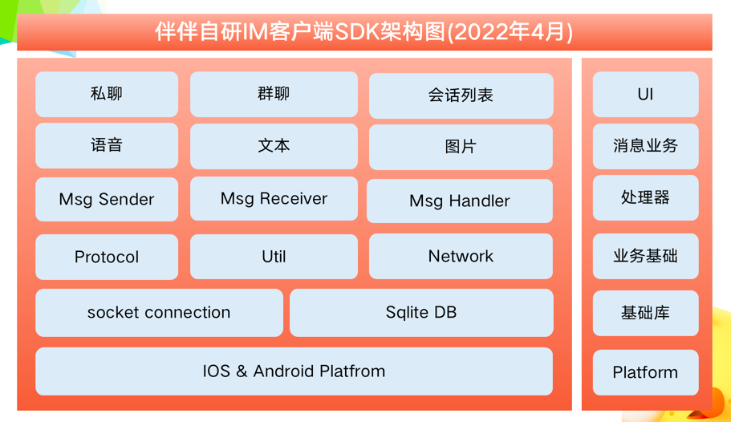
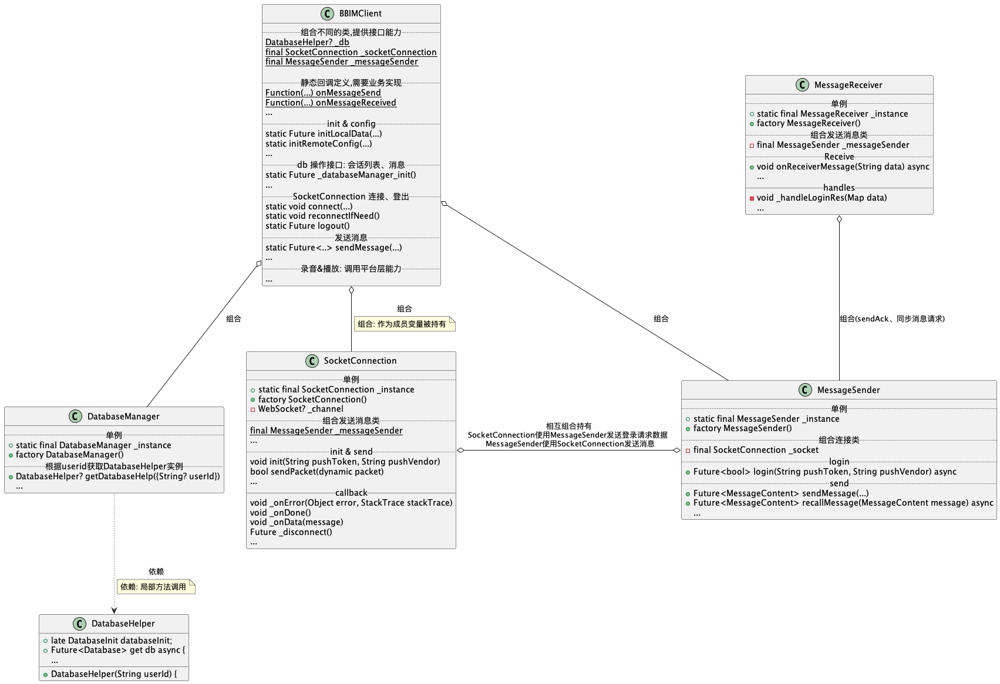

## Features

一款自主技术研发的即时通讯开发工具集，涵盖WebSocket长连接、消息首发、本地信息存储等特性




## 使用说明

#### 1. 依赖引入

​	版本变更请查阅[ChangeLog](./CHANGELOG.md)

```yaml
dependencies:
  flutter:
    sdk: flutter

  package_limit:
    git:
      url: git@github.com:olaola-chat/cli-bbim.git
      ref: 1.6.8
```


#### 2. 代码配置
```dart
	//引入依赖库  
	import 'package:pulse_im/pulse_im.dart';
  
	//初始化基本信息
	PulseIMClient.initLocalData(uid, name, portraitUri, baseFileDir, pkg, version)
	PulseIMClient.initRemoteConfig(imToken.token, imToken.heart, imToken.socketAddress, imToken.imDomain);
	//连接通道
 PulseIMClient.connect(tokenInfo.token ?? '', tokenInfo.vendor ?? '', 
        customClient: Xhr.obtainSocketHttpClient());
	
	//注册回调
	//收到消息的回调函数（消息已本地存储）
	PulseIMClient.onMessageReceived = (MessageContent msg, int left,
        {Map<String, dynamic>? userInfo, int? lastMsgId}) {}
	//调用发送消息接口 [sendMessage] 结果的回调（消息已本地存储，且已发送给服务端）
	PulseIMClient.onMessageSend = (int messageId, String status, int code,  {String? errorMsg ,int? sentTrigger}) {}
	//收到已读消息回执的回调函数
	PulseIMClient.onReceiveReadReceipt = (String conversationType, String targetId, int timestamp) {}
	//撤回消息回调函数
	PulseIMClient.onRecallMessageReceived = (MessageContent msgContent) {}
	//输入状态的监听
	PulseIMClient.onTypingStatusChanged = (String conversationType, String targetId) {}
	//被踢下线
	PulseIMClient.onKickOut = (int reason) {}
	//登录失败
	PulseIMClient.onLoginError = (int code, String msg) {}
	//在线通知栏
	PulseIMClient.onNotification = (String payload) {}
	//收到cmd 消息
	PulseIMClient.onCmdMessageReceived = (MessageContent msg) {}
	//一些在线消息例如vip升级等
	PulseIMClient.onOnlineMsg = (String payload) {}

	//发送消息
  PulseIMClient.sendMessage(type, targetId, content, pushContent, pushData, '' , saveToDb);

```

#### 核心代码
* 初始化：PulseIMClient
* Socket链接：SocketConnection
* 发送消息：MessageSender
* 接收消息：MessageReceiver
* 数据库操作：DatabaseInit， DatabaseHelper

#### 核心业务代码类图
 
* 组合关系: 作为类成员变量被持有
* 依赖关系: 不被当前类持有，仅局部函数调用(函数变量、返回值、函数体内)




#### 数据表
* 消息表：MessageContent， 对应model类：MessageContent
* 会话表：Conversation， 对应model类：Conversation


## 完整使用样例

```dart
参见im.dart
https://github.com/olaola-chat/cli-partying/blob/master/banban_base/bbcore/lib/src/im.dart

参见common_im_wrapper.dart
https://github.com/olaola-chat/cli-partying/blob/master/banban_base/bbcore/lib/src/common_im_wrapper.dart
```


#### 补充资料：

 1. [协议文档](./im协议文档.pdf)


